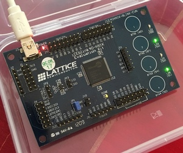

# Learn FGPA

I think the best way to understand something is to try and build something interesting with it. This is a repository of hardware projects using FPGAs.

# Project Index

This is a summary of projects you will find in this repository.

## Latice iCE40HX1k

These projects use the Lattice iCE40HX1k and the *icestorm* open source FPGA toolchain.

- **led_chaser** - a "hello world" for FPGA
- **led_breathe** - LEDs and PWM 

## Latice iCE40UP5k

These projects use the Lattice iCE40HX1k and the *icestorm* open source FPGA toolchain.

- **ultrasonic** - talking to ultrasonic sensor HC-SR04 and displaying distance on a 4-digit 7-segment display
