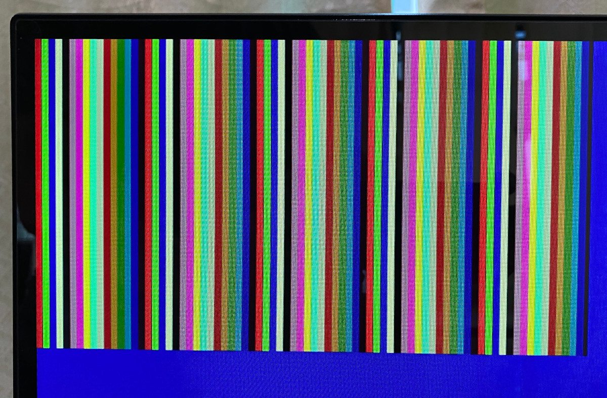

# SPRAM test
 

This project demonstrates how to use the SPRAM blocks in the Lattice iCE40UP5k FPGA.

There is 1024 kbits of SPRAM which is enough to support 2 x 320 x 240 x 4 bits of colour.

The RAM is first filled with 4-bit colour indices. There is a lookup table from the 4-bit index to a 12-bit RGB value.

The RGB values are sent to a VGA module for display.

The output hsync and vsync signals are delayed by a few clock cycles to give a chance for the SPRAM values to be read.
