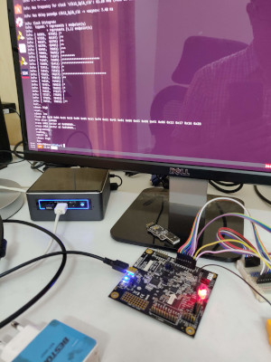

## Blinky for Migen

This is a basic blinky example for migen.

Tested using the Lattice iCE40UP5k evaluation board.

Follow migen installation instructions here:

https://github.com/m-labs/migen

## Running it 

```
sudo python3 blinky.py 

```

The above will show generated verilog output, do the synthesis, and upload the bitstream to the FPGA.

