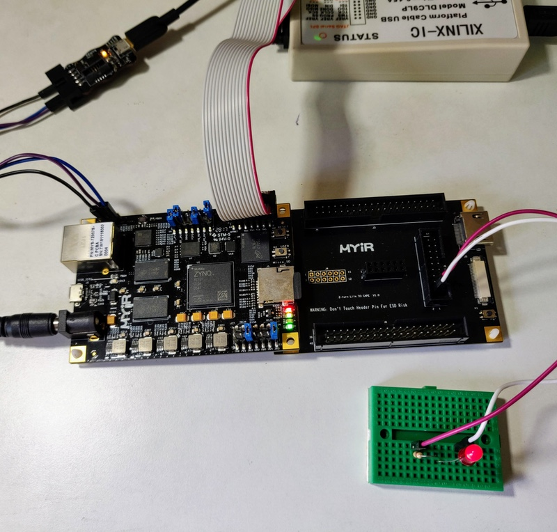
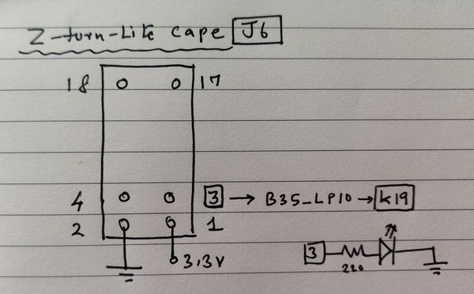

## A Blinky on Xilinx Zynq

In this project we create a blinky on the PL (Programmable Logic) of Xilinx XC7Z007S using the clock from the PS (Processing System), using Vivado 2018.3. The board used 
for this project is the z-turn-lite from MYIR.

You upload code separately (RAM, not flash, in this case) to the PS and PL. The PS just prints "hello world" repeatedly on UART, whereas the PL blinks the LED.

## Video for Vivado setup

There's no source code for this project. Instead, you can follow the video below to create this project.

https://www.youtube.com/watch?v=-J7kvz2BwHw

## What you need

A few things to note:

- You need [z-turn-lite.tcl][3] for setting up the Zynq PS.
- You need a Xilinx platform cable or equivalent to upload code via JTAG
- You need a USB to UART to observe the output. We used [Bumpy][2].

Also, here's a reference for header *J6* of the z-turn-lite cape, for setting up the LED:

## Acknowledgment

This work is partially based on this very helpful [article][1] on setting up PS and PL on Vivado by Rohit Singh.

[1]: https://numato.com/kb/styx-use-xilinx-zynq-ps-pll-clocks-fpga-fabric/
[2]: https://docs.electronut.in/bumpy/
[3]: http://d.myirtech.com/Z-turn-Lite/public/DVD/05-Programmable_Logic/

