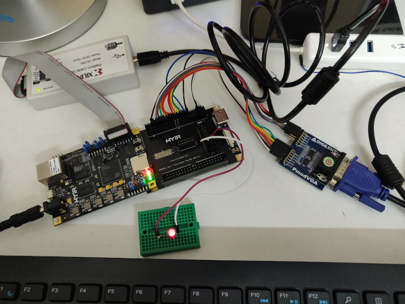
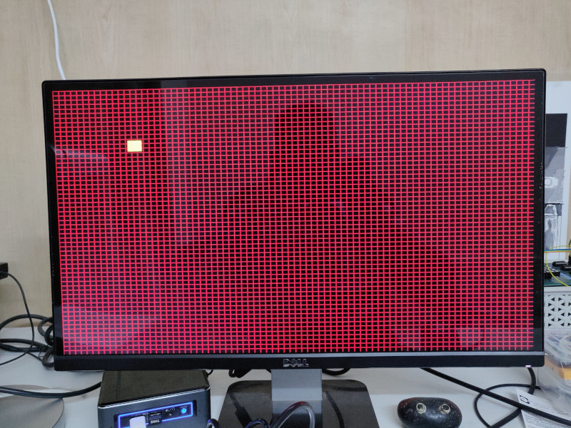

# Simple VGA with Xilinx Zynq XC7Z007

This example shows a 640x480 VGA output from the PL (Programmable Logic). The PS (Processing System)
just prints "hello world" via UART.

This repo does not have the Vivado project. It can be easily created by following steps similar to the 
**blink** example in this repo.

The source file **vga.v** is in the repo.

Here's the block design:

We used a Digilent PmodVGA adapter in this project.

Here are the wiring details:

