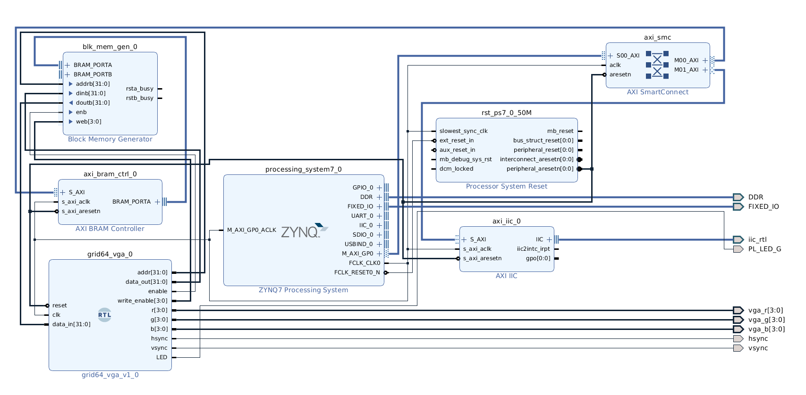

## AMG8833 8x8 Thermal Grid Sensor + VGA on Xilinx Zynq 7000

In this project, we read thermal data from an AMG8833 thermal grid sensor, and display it via VGA using an Avnet Minized.

We communicate with the AMG8833 using I2C, using the IIC IP block  on the PL. We use a dual port BRAM block to communicate the thermal data from the code running on the PS to the VGA module on the PL.

The data is upscaled from 8x8 to 32x32 on the PS, before sending it to the PL.

To send VGA output to the monitor, we used a Digilent PmodVGA adapter.

[](https://youtu.be/CUWag961Cfk)

(Click on image to see video.)

## Block Diagram 



## On the PL

Here's the VGA module on the PL. It reads from BRAM, and splits up the video frame into a 32x32 grid to display the image.


```
`timescale 1ns / 1ps
`default_nettype none

module grid64_vga(
    input wire reset,
    input wire clk,
    
    // BRAM
    output wire [31:0] addr,
    input wire [31:0] data_in,
    output wire [31:0] data_out,
    output wire enable,
    output wire [3:0] write_enable,
    
    // VGA
    output reg [3:0] r,
    output reg [3:0] g,
    output reg [3:0] b,
    output reg hsync,
    output reg vsync,
    
    // debug LED
    output reg LED
    );
    
    
    // blink LED 
    reg [23:0] led_counter;
    always @ ( posedge clk ) begin      
    
        led_counter <= led_counter + 1;
    
        if (!led_counter) begin
            LED <= ~LED;
        end        
    end
    
    //
    // BRAM
    // 
    
    
    // set BRAM parameters 
    assign enable = 1'b1;
    assign write_enable = 4'b0000;
    
    always @ ( posedge clk ) begin      
    
        if (!led_counter) begin
            LED <= ~LED;
        end        
    end
    
    //
    // VGA
    //
    
    // create a strobe for 25 MHz VGA clock
    // from: http://zipcpu.com/blog/2017/06/02/generating-timing.html
    reg ck_stb;
    reg	[15:0]	counter;
    always @(posedge clk) begin
	   { ck_stb, counter } <= counter + 16'h8000;
    end
      
        
    // generate hsync and vsync
    // Part of this code is adapted from the VGA example from http://8bitworkshop.com/
    reg [10:0] hpos;
    reg [10:0] vpos;

    // declarations for TV-simulator sync parameters
    // horizontal constants
    parameter H_DISPLAY       = 640; // horizontal display width
    parameter H_BACK          =  48; // horizontal left border (back porch)
    parameter H_FRONT         =   16; // horizontal right border (front porch)
    parameter H_SYNC          =  96; // horizontal sync width
    // vertical constants
    parameter V_DISPLAY       = 480; // vertical display height
    parameter V_TOP           =   33; // vertical top border
    parameter V_BOTTOM        =  10; // vertical bottom border
    parameter V_SYNC          =   2; // vertical sync # lines
    // derived constants
    parameter H_SYNC_START    = H_DISPLAY + H_FRONT;
    parameter H_SYNC_END      = H_DISPLAY + H_FRONT + H_SYNC - 1;
    parameter H_MAX           = H_DISPLAY + H_BACK + H_FRONT + H_SYNC - 1;
    parameter V_SYNC_START    = V_DISPLAY + V_BOTTOM;
    parameter V_SYNC_END      = V_DISPLAY + V_BOTTOM + V_SYNC - 1;
    parameter V_MAX           = V_DISPLAY + V_TOP + V_BOTTOM + V_SYNC - 1;
    
    wire hmaxxed = (hpos == H_MAX) || !reset;	// set when hpos is maximum
    wire vmaxxed = (vpos == V_MAX) || !reset;	// set when vpos is maximum
          
          
    // horizontal position counter
    always @(posedge clk)
    begin
    
        if (!reset) begin
            hpos <= 0;
        end
    
        if (ck_stb) begin
            hsync <= ~(hpos>=H_SYNC_START && hpos<=H_SYNC_END);
            if(hmaxxed)
              hpos <= 0;
            else
              hpos <= hpos + 1;
        end
    end
    
    // vertical position counter
    always @(posedge clk)
    begin
    
        if (!reset) begin
            vpos <= 0;
        end
        
        if (ck_stb) begin
            vsync <= ~(vpos>=V_SYNC_START && vpos<=V_SYNC_END);
            if(hmaxxed)
              if (vmaxxed)
                vpos <= 0;
              else
                vpos <= vpos + 1;
        end
    end
    
    // display_on is set when beam is in "safe" visible frame
    wire display_on = (hpos<H_DISPLAY) && (vpos<V_DISPLAY);
 
    
    parameter N = 32;
    parameter W = 640/N; // 640/16
    
    reg [15:0] index;
    
    // set address    
    assign addr = 4*index;
      
    // clocked VGA output
    always @ (posedge clk) begin
   
        
        if (display_on) begin 
        
          if (hpos < 80 || hpos > 560) 
            begin
            
              r <= {4{1'b0}};
              g <= {4{1'b0}};
              b <= {4{1'b0}};
          
            end
          else 
            begin 
            
              // i = (hpos - 80)/W
              // j = (vpos)/W
              // index = 640*j + i
              index <= (N*((640-vpos)/W) + (hpos - 80)/W);

              r <= data_in[7:4];
              g <= data_in[15:12];
              b <= data_in[23:20];
           
            end
          
        end
    end    
    
endmodule
```

## On the PS

Here's the code running on the PS:

```
/*
 *
 * main.c
 *
 * This program uses the IIC driver t communicate with the AM88 8x8 thermal sensor.
 * The data is sent to PL via BRAM, where it's sent out via VGA.
 *
 */

#include <stdio.h>
#include <stdbool.h>
#include "platform.h"
#include "xil_printf.h"

#include "xparameters.h"
#include "xiic.h"

#include "blerp.h"

//#include "arm_math.h"
#include "interpolated_colors.h"

#define GRID_START (uint32_t*)XPAR_AXI_BRAM_CTRL_0_S_AXI_BASEADDR


/*
 * The following constants map to the XPAR parameters created in the
 * xparameters.h file. They are defined here such that a user can easily
 * change all the needed parameters in one place.
 */
#define IIC_BASE_ADDRESS	XPAR_IIC_0_BASEADDR


XIic IicInstance;	/* The instance of the IIC device. */

int ByteCount;
u8 send_byte;
u8 write_data [256];
u8 read_data [256];
u8 i2c_device_addr = 0x69; // AMG88 I2C address

uint8_t data_raw[128];
int16_t data[64];
uint32_t cgrid[64];

uint32_t cigrid[1024];


u8 AMG88_ReadReg(u8 Reg, u8 *Bufp, u16 len)
{
	write_data[0] = Reg;
	ByteCount = XIic_Send(IIC_BASE_ADDRESS, 0x69, (u8*)&write_data, 1, XIIC_REPEATED_START);
	ByteCount = XIic_Recv(IIC_BASE_ADDRESS, 0x69, (u8*)Bufp, len, XIIC_STOP);
	return(ByteCount);
}

void AMG88_test()
{
	u8 count = AMG88_ReadReg(0x80, data_raw, 128);

	//xil_printf("Read %d bytes\n\r", count);

	uint8_t fr;
	AMG88_ReadReg(0x02, &fr, 1);
	xil_printf("Frame rate: %d \n\r", fr);

	for (int i = 0; i < count; i++) {
		xil_printf("data[%d] = %d\n\r", i, data_raw[i]);
	}
}


/**
 * @brief Convert 12 bit Two's complement hex to decimal
 */
static int16_t amg88_pixel_temperature(uint8_t t00l, uint8_t t00h)
{
    int16_t shVal = ((int16_t)(t00h & 0x07) << 8) | t00l;
    if (0 != (0x08 & t00h))
    {
        shVal -= 2048;
    }
    shVal *= 64;
    return (shVal);
}

bool AMG88_read_grid()
{
	u8 count = AMG88_ReadReg(0x80, data_raw, 128);
	if (count != 128)
		return false;

	int j= 0;
	for (int i = 0; i < 128; i+=2) {
		uint8_t t00l = data_raw[i];
		uint8_t t00h = data_raw[i+1];
		int16_t temp = amg88_pixel_temperature(t00l, t00h);
		data[j++] = temp/256;
	}

#if 0 //test
	for(int i = 0; i < 64; i++) {
		xil_printf("data[%d] = %d\n\r", i, data[i]);
	}
#endif


	return true;
}

image_t src;
image_t dst;

void copy_colour_grid(uint32_t* grid)
{

	// map to colour
	for(int i = 0; i < 64; i++) {

		uint16_t val = constrain_q15(100*data[i], MINTEMP, MAXTEMP);
		uint32_t color_val = map_q15(val, MINTEMP, MAXTEMP, 0, COLORDEPTH - 1);

		cgrid[i] = hue_line[color_val];
	}
	// interpolate
	src.pixels = cgrid;
	src.w = 8;
	src.h = 8;
	dst.pixels = grid;
	dst.w = 32;
	dst.h = 32;
	scale(&src, &dst, 4, 4);
}

int main()
{
    init_platform();

    uint32_t* grid = GRID_START;

    // draw a diagonal red line on a white background
	int N = 32;
	for(int i = 0; i < N; i++){

		for (int j = 0; j < N; j++) {

			int index = N*i + j;

			if (i == j) {

				grid[index] = 0x000000ff;
			}
			else {
				grid[index] = 0x00ffffff;
			}

		}
	}

	// update BRAM with sensor data
	for (;;) {

		AMG88_read_grid();
		copy_colour_grid(grid);

		usleep(1000);

	}

    cleanup_platform();
    return 0;
}


```

In addition, the header files for bilinear interpolation and the colour map are in the repository.
