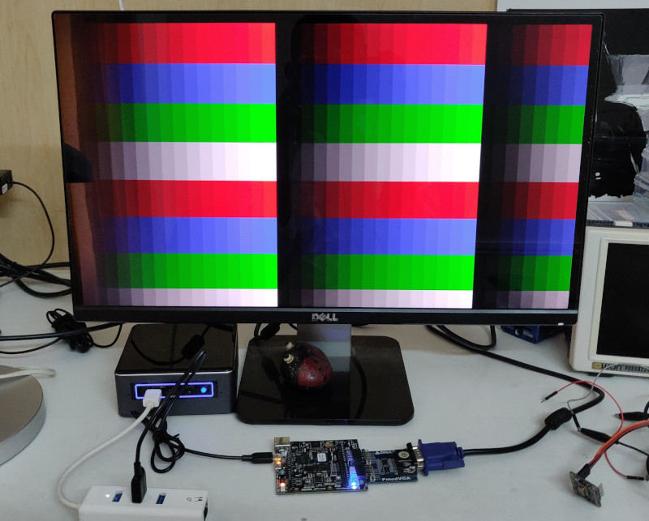
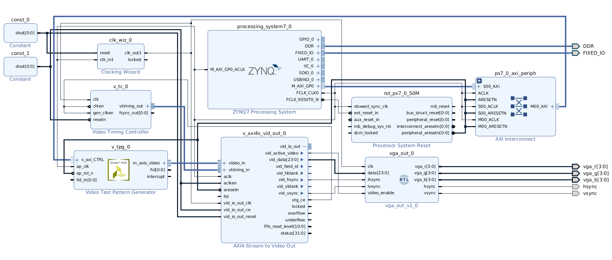

## Xilinx Video IP Test



In this project, we explore the following video IPs provided by Xilinx:

- Video Timing Controller (VTC)
- Video Test Pattern Generator (TPG)
- AXI Stream to Video Out

We use the above IPs to generate test patterns and display them via VGA.

This project uses Vivado 2018.3.

Here's the block diagram:



Here's the Verilog code that splits the data from *AXI Stream to Video Out* into 4 bit RGB video suitable 
for a Digilent PmodVGA adapter.

```
module vga_out(
    input wire clk,
    input wire [23:0] data,
    input wire ihsync,
    input wire ivsync,
    input wire video_enable,
    output reg [3:0] vga_r,
    output reg [3:0] vga_g,
    output reg [3:0] vga_b,
    output reg hsync,
    output reg vsync
    );
    
    
    always @ (posedge clk) begin
    
        if (!video_enable) 
            begin
                vga_r <= 4'd0;
                vga_g <= 4'd0;
                vga_b <= 4'd0;
            
            end
        else 
            begin        
                vga_r <= data[23:20];
                vga_g <= data[15:12];
                vga_b <= data[7:4];
            end
            
        hsync <= ihsync;
        vsync <= ivsync;        
            
    end
    
endmodule
```


Here's the code on the PS:

```
#include <stdio.h>
#include "platform.h"
#include "xil_printf.h"

#include "xil_io.h"
#include "sleep.h"

#define TPG_BASS_ADDR XPAR_V_TPG_0_S_AXI_CTRL_BASEADDR

void tpg_start(int value) {
	// set H & W
	Xil_Out32(TPG_BASS_ADDR + 0x0010, 480);
	Xil_Out32(TPG_BASS_ADDR + 0x0018, 640);
	// set pattern
	Xil_Out32(TPG_BASS_ADDR + 0x0020, value);
	// set auto-start
	Xil_Out32(TPG_BASS_ADDR + 0x0000, 0x81);
}

int main()
{
    init_platform();

    tpg_start(0x9);

    print("Video IP Test...\n\r");

    // cycle through patterns
    int i = 1;
    for(;;) {

    	tpg_start(i++);

		if (i == 0x14) {
			i = 1;
		}

    	usleep(3000000);
    }


    cleanup_platform();
    return 0;
}
```

## Video

You can see this project in action below:

